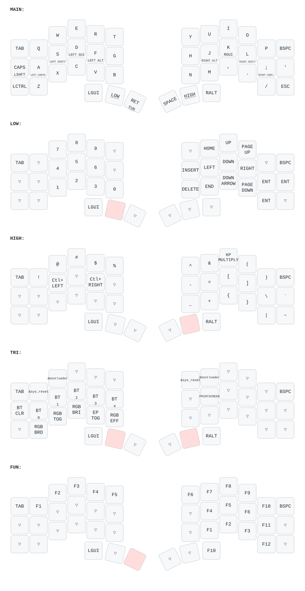

ZMK config for a PandaKB Corne, built against stock `zmkfirmware/zmk` v0.3.

- Keymap: [`config/Corne.keymap`](config/Corne.keymap)
- Board settings: [`config/Corne.conf`](config/Corne.conf)
- **Per-key RGB**: this repo replaces ZMK's underglow with its own renderer that colours every key by
  what it does on the active layer — see [`docs/perkey-rgb.md`](docs/perkey-rgb.md).

Firmware is built by GitHub Actions on every push. **Both halves must be flashed** for any per-key
RGB change.
